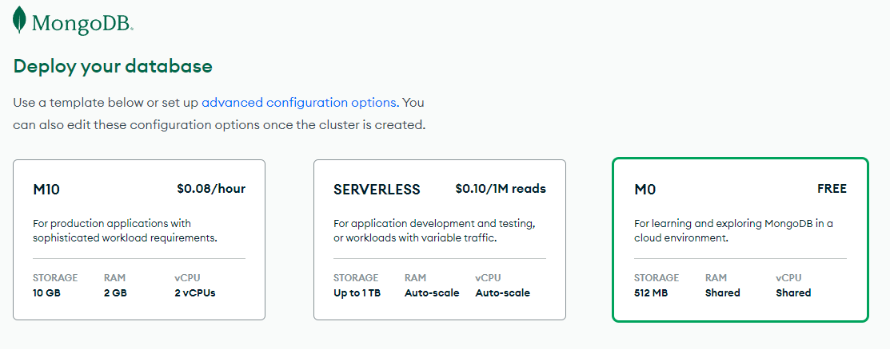
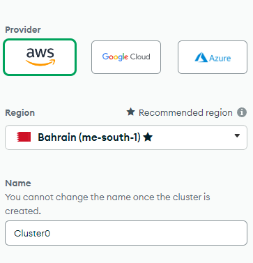
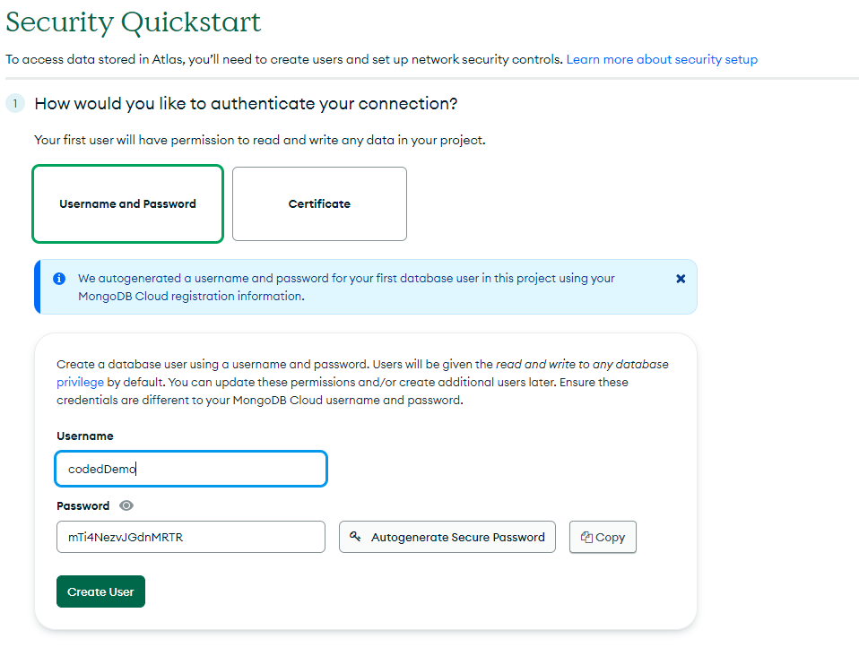
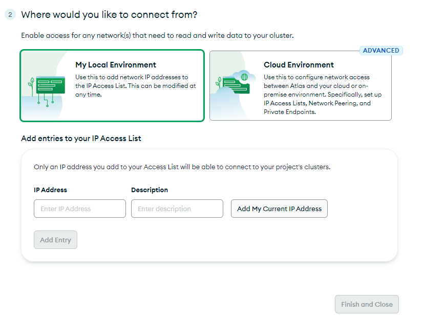

## Creating your first Cluster

1. Log into your Atlas account.
2. Click on **New Project** and give it a name like `fullstack`. 
3. Click on **Build a database**.

4.  Select **M0**.

5. Select your **Aws** Cloud Provider & **Europe** Region

6. Click on **create** a cluster

Now your cluster is being created and it may take up to 5 mins.

## Add Your Connection IP Address to IP Access List.

In Atlas, you can only connect to a cluster from a trusted IP address. Within Atlas, you can create a list of trusted IP addresses.

## Create a Database User for Your Cluster

You must create a database user to access your cluster. For security purposes, Atlas requires clients to authenticate as MongoDB database users to access clusters.

1. Choose a **username** and a **password** for your user and click on **create User**. Be sure to remember the username and password because we will need them to access our database later.

Add your IP address to the IP access list by following the steps:

2. Click on **Add My Current IP Address**.
   

3. Click **Finish and Close**.

