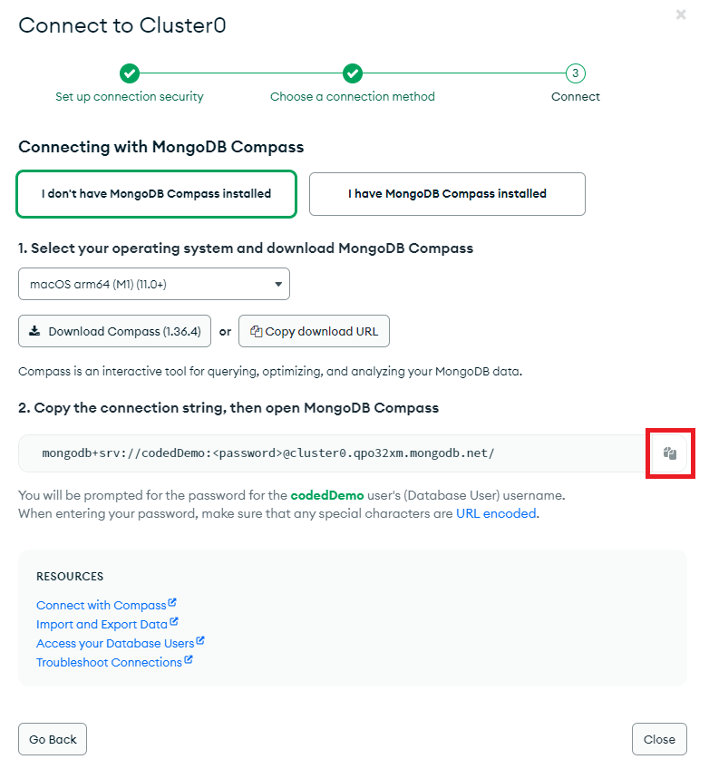
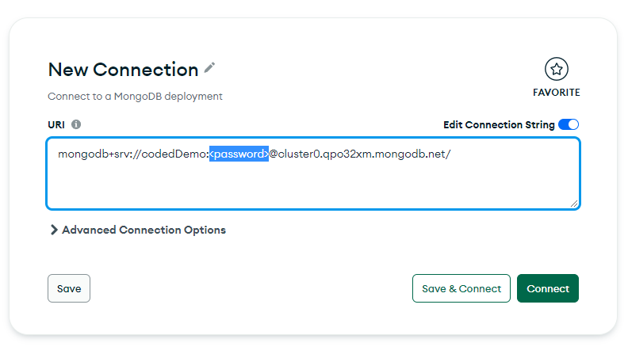

**MongoDB Compass** is a powerful GUI for querying, aggregating, and analyzing your MongoDB data in a visual environment.

1. On the left panel under **Deployment** click on **Database**.
2. You will see the cluster we created, click on **Connect** button.
3. A modal will open, select Connect using **Compass**.
4. Select your operating system, download and setup **MongoDB Compass**.
   
5. Copy the connection string, then open **MongoDB Compass** app. Don't forget to change `<password>` to your user password.
6. Paste your connection string and click **Connect**
   
